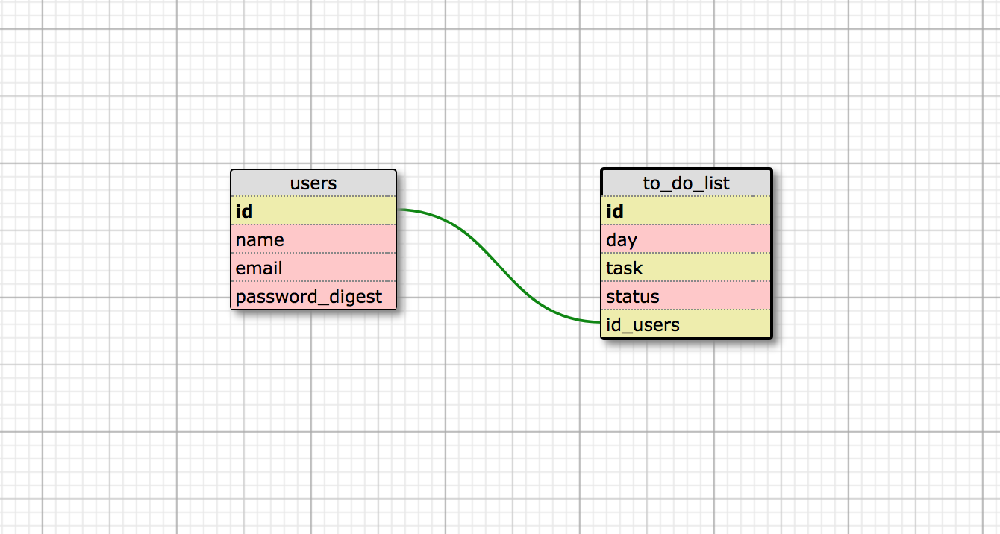

# TDL(TO DO LIST)

The To Do List App does exactly what it implies. A user can create an account and once logged in they can create a list of tasks and as they complete each task they can mark them completed.   

Things you may want to cover:

## Setup

To run this application locally, please clone this repo and follow the steps below:

`$ bundle`

`$ rake db:create db:migrate`

## Server Start-up

After completing the steps above, start up your local server:

`$ rails s`

Navigate to the local port indicated (most likely localhost:3000)

## Run the Test Suite

To run the full test suite:

`$ rspec`

To run only a portion of the test suite:

`$rspec spec/file-path`

## Schema

## Additional Resources

For more information about the tools used in this process, please visit the links below:

* Heroku - https://devcenter.heroku.com/articles/getting-started-with-rails5